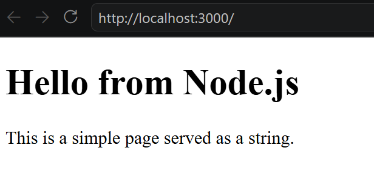
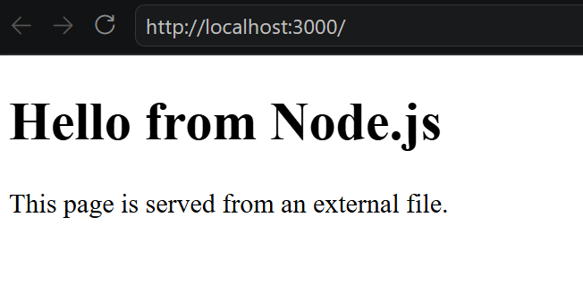
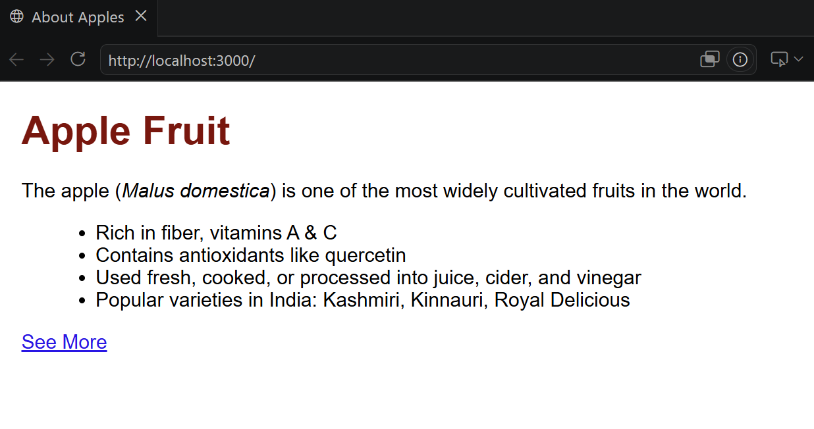
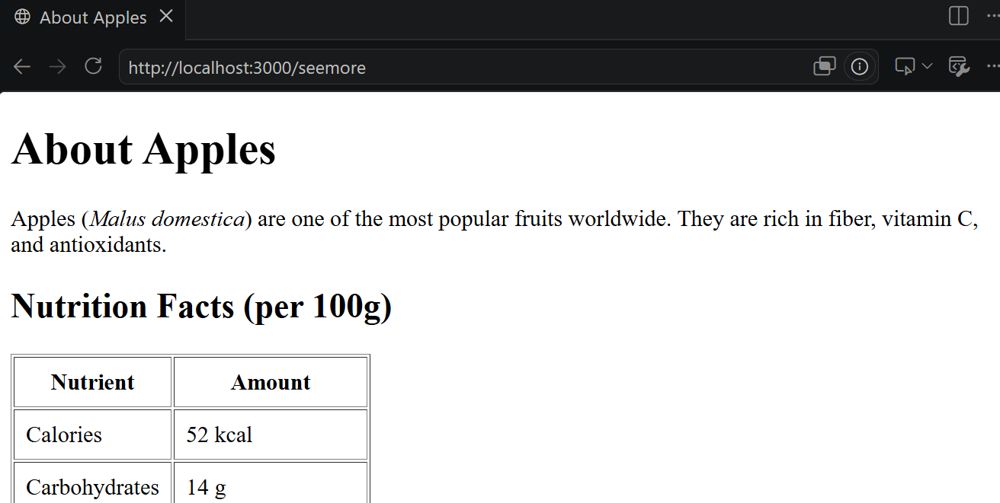

# Introduction to Node.js
### Dr.S.Rajasekaran
#### AP-II/AI&DS/KCT
---

## What is Node.js?
- Runtime environment for running JavaScript outside the browser.
- Built on Google Chrome’s V8 engine.
- Designed for fast, scalable network applications.
---

## Why Learn Node.js?
- **Single Language:** Use JavaScript for both frontend and backend.
- **Non‑blocking I/O:** Handles many requests at once without waiting.
- **Community & Ecosystem:** Huge library of packages via **npm (Node Package Manager)**.
- **Real‑world use:** Powers apps like Netflix, LinkedIn, PayPal.

---
### Event‑Driven Architecture
- Uses an event loop to process tasks asynchronously.
- Example: Reads files without blocking other code.

---
### Modules
- Built‑in: fs, http, path.
- External: install with npm install <package>.
- Example: npm install express. 

---
### npm (Node Package Manager)  
   - Command line tool to install and manage packages.  
   - Example: `npm install express`.
---
# Setup Node.js Server on Windows
---
### Step 1: Install Node.js
- Go to https://nodejs.org
- Download the LTS (Recommended) version for Windows
- Run the installer → click Next → keep defaults → finish
- Verify installation: (Open CMD Prompt and type)
```bash
node -v
v24.18.1 (node version)

npm -v
11.16.0 (npm version)
```
---
### Step 2: Create a Project Folder
- Open File Explorer → make a folder, e.g., node-server
- Open Command Prompt / PowerShell in that folder:
```bash
  cd path\to\node-server
```
---
### Step 3: Initialize Project
```bash
npm init -y (This creates a package.json file)
```
#### package.json
```json
{
  "name": "example",
  "version": "1.0.0",
  "description": "",
  "main": "index.js",
  "scripts": {
    "test": "echo \"Error: no test specified\" && exit 1"
  },
  "keywords": [],
  "author": "",
  "license": "ISC",
  "type": "commonjs"
}

```
---
### Step 4: Create Server File
- Create a file server.js with following content
```js
const http = require('http');

const server = http.createServer((req, res) => {
  res.writeHead(200, {'Content-Type': 'text/plain'});
  res.end('Hello World from Node.js!');
});

server.listen(3000, () => {
  console.log('Server running at http://localhost:3000/');
});
```
[code-example](code-examples/01-hello-node-js/server.js)
---
## Step 5: Run the Server
```bash
node server.js
```
- (Open browser → visit http://localhost:3000)
---

# Setup Node.js Server on macOS
---
### Step 1: Install Node.js
- Open Terminal
- Install Homebrew if not already installed:
- Install Node.js via Homebrew:
```bash
  brew install node
```
- Verify installation:
```bash
node -v
v24.18.1 (node version)

npm -v
11.16.0 (npm version)
```
- Repeat Step 2 to 5 (same as windows)
---
# Simple HTTP Server in Node JS
---
- This code creates a basic HTTP web server using Node.js's native http module. 
- It listens on port 3000 and responds with an HTML heading when accessed.
```js
const http = require('http');

const server = http.createServer((req, res) => {
  res.writeHead(200, {'Content-Type': 'text/html'});
  res.end('<h1> Hello HTML</h1>');
});

server.listen(3000, () => {
  console.log('Server running at http://localhost:3000/');
});
```
---
### importing http module
```js
const http = require('http');
```
- The Node.js http module is a built‑in, low‑level API that let us create both HTTP servers and clients without installing extra packages.
- provides functionality to transfer data over the **HyperText Transfer Protocol**. 
- It handles requests and responses as streams, supports chunked messages, and gives us full control over headers and body parsing.
---
### create Server
```js
const server = http.createServer((req, res) => { ... });
```
- http.createServer(): Instantiates a web server.
- Callback Function: Executes every time an incoming request hits the server.
  - req (Request): Object containing information about the request (e.g., URL, headers, HTTP method).
  - res (Response): Object used to build and send the response back to the client.
---
### Set the Response Header
```js
res.writeHead(200, {'Content-Type': 'text/html'});
```
- 200: The HTTP status code indicating success (OK).

- 'Content-Type': **'text/html'**:
  - Specifies that the body content is HTML
  - prompting the browser to parse and render it as <mark>web markup</mark>.
---

### Send the Body & End Response
```js
res.end('<h1> Hello HTML</h1>');
```
- res.end(): Transmits the response body and signals to the server that all headers and body data have been sent.

---
### Listen on a Port
```js
server.listen(3000, () => {
  console.log('Server running at http://localhost:3000/');
});
```
- 3000: Specifies the port number the server will listen on.
- Callback: Logs a status message to the console once the server is successfully running.
---
### Core Modules

| Module  | Purpose                                |
|---------|----------------------------------------|
| http    | Create servers and clients             |
| fs      | File system operations (read/write)    |
| path    | Work with file paths                   |
| os      | System info (CPU, memory, hostname)    |
| events  | Event emitter pattern                  |
| url     | Parse and format URLs                  |

---
#### Core Modules (cont..)

| Module  | Purpose                                |
|---------|----------------------------------------|
| crypto  | Hashing, encryption                    |
| net     | TCP servers/clients                    |
| stream  | Handle streaming data                  |
| util    | Utility functions                      |
| zlib    | Compression/decompression              |

---

### Http Server (Serving page as string)
```js [7-18]
const http = require('http');

const server = http.createServer((req, res) => {
  res.writeHead(200, { 'Content-Type': 'text/html' });

  // Serve a simple HTML page as a string
  const page = `
    <!DOCTYPE html>
    <html>
      <head>
        <title>My Simple Page</title>
      </head>
      <body>
        <h1>Hello from Node.js</h1>
        <p>This is a simple page served as a string.</p>
      </body>
    </html>
  `;

  res.end(page);
});

server.listen(3000, () => {
  console.log('Server running at http://localhost:3000/');
});
```
[code](code-examples/03-http-all-in-strings/server.js)
---
#### Output

---
#### explanation
- Instead of just **Hello HTML**, we created a multi‑line string (page) containing a full HTML document.
- res.end(page) sends the entire HTML page to the browser.
- The browser will render it like a normal webpage.
---
### Tasks
- Hello World Page
  - Serve a string containing &lt;h1&gt;Hello World&lt;/h1&gt; as HTML content.
  - Students should see "Hello World" in large heading when they open the page.

- Student Info Table
  - Serve an HTML string with a &lt;table&gt; showing 3 students (Name, Roll No, Marks).

---
- Favorite Movies List
  - Serve an HTML string containing an &lt;ol&gt; list of 5 favorite movies.
  - Each movie should be inside &lt;li&gt; tags.
- Simple Registration Form
  - Serve an HTML string with a form containing fields: Name, Email, Password
  - Include a &lt;button&gt; labeled "Submit".
---
#### Lmitations & Issues
- Hard‑coded HTML
  - The HTML is embedded directly in your JavaScript file.
  - Any change to the page requires editing the server code and restarting it.

- No Separation of Concerns
  - Mixing server logic and HTML content makes the code messy.
  - Harder to maintain compared to serving external .html files.
---
- No Static Assets Support
  - You can’t easily serve CSS, JS, or images this way.
  - Everything must be inline, which is impractical for real websites.

- Scalability Problems
  - Works fine for a demo, but not for larger apps.
  - As pages grow, embedding them as strings becomes unreadable.
---
#### Better Approaches
- Use fs.readFile to serve external index.html files.
- Use a framework like Express.js for routing and static file serving.
- Keep HTML, CSS, and JS in separate files for clarity and maintainability.
---

### fs module
- The fs (File System) module in Node.js is a built‑in API that let us interact with the file system and do operations like
  - reading
  - writing
  - creating
  - deleting
  - watching files and directories. 
---
### Key Aspects
- Introduced in Node.js v0.10.0 and is stable.
- Provides three styles of APIs:
  - Synchronous → blocks execution until the operation completes.
  - Callback‑based (async) → non‑blocking, uses callbacks.
  - Promise‑based (fs/promises) → modern async/await style.
- Modeled on POSIX functions (standard UNIX file system calls).
---
### fs methods
| Method                          | Purpose                     | Example                                                   |
|---------------------------------|-----------------------------|-----------------------------------------------------------|
| fs.readFile(path, callback)     | Read a file asynchronously  | fs.readFile('file.txt', 'utf8', (err, data) => { ... })   |
| fs.readFileSync(path)           | Read a file synchronously   | const data = fs.readFileSync('file.txt', 'utf8');         |
| fs.writeFile(path, data, cb)    | Write data to a file        | fs.writeFile('file.txt', 'Hello', err => { ... })         |

--
| Method                          | Purpose                     | Example                                                   |
|---------------------------------|-----------------------------|-----------------------------------------------------------|
| fs.appendFile(path, data, cb)   | Append data to a file       | fs.appendFile('file.txt', 'More text', err => { ... })    |
| fs.unlink(path, callback)       | Delete a file               | fs.unlink('file.txt', err => { ... })                     |
| fs.mkdir(path, callback)        | Create a directory          | fs.mkdir('newDir', err => 
{ ... })                          |

--
| Method                          | Purpose                     | Example                                                   |
|---------------------------------|-----------------------------|-----------------------------------------------------------|
| fs.readdir(path, callback)      | Read directory contents     | fs.readdir('.', (err, files) => { ... })                  |
| fs.stat(path, callback)         | Get file metadata           | fs.stat('file.txt', (err, stats) => { ... })              |
| fs.watch(path, callback)        | Watch file changes          | fs.watch('file.txt', (event, filename) => { ... })        |

---
### Serving html from external file
```js
const http = require('http');
const fs = require('fs');

const server = http.createServer((req, res) => {
  res.writeHead(200, { 'Content-Type': 'text/html' });

  // Read and serve the HTML file
  fs.readFile('index.html', (err, data) => {
    if (err) {
      res.writeHead(500, { 'Content-Type': 'text/plain' });
      res.end('Error loading page');
    } else {
      res.end(data);
    }
  });
});

server.listen(3000, () => {
  console.log('Server running at http://localhost:3000/');
});
```
[code-server.js](code-examples/05-http-with-fs/server.js)
[code-index.html](code-examples/05-http-with-fs/index.html)
---
#### Output

---
#### Explanation
- http.createServer → creates a basic web server.
- fs.readFile('index.html') → loads the HTML file asynchronously from disk
- Error handling → if the file is missing or unreadable, it sends a 500 error message.
```js
fs.readFile('index.html', (err, data) => {
    if (err) {
      res.writeHead(500, { 'Content-Type': 'text/plain' });
      res.end('Error loading page');
    } else {
      res.end(data);
    }
  });
```
- res.end(data) → sends the file contents as the HTTP response.
---

---

---

